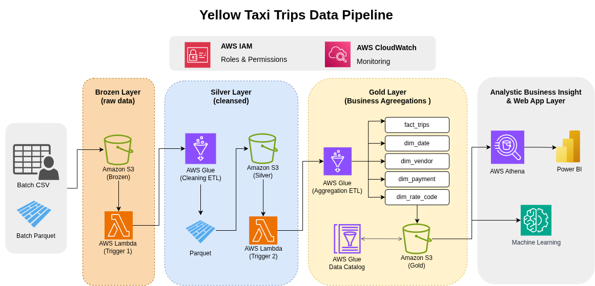

# Big Data Pipeline for NYC Taxi Price Prediction

## 📊 Project Overview

This project implements a comprehensive **Big Data Pipeline on AWS** for predicting NYC taxi fares using Medallion Architecture. The pipeline processes raw taxi data through multiple stages, performs data cleaning, transformation, feature engineering, and enables both real-time analytics and machine learning model training.

The pipeline is designed as part of a Big Data course project to demonstrate practical applications of cloud-based data engineering and predictive analytics.

## 🏗️ Architecture Design

### Medallion Architecture Layers

The pipeline follows a three-layer Medallion Architecture pattern:

#### 1. **Bronze Layer (Raw Data)**
- **Data Source**: Batch CSV and Parquet files uploaded to S3
- **Storage**: AWS S3 bucket
- **Format**: Original raw data format

#### 2. **Silver Layer (Cleaned Data)**
- **Processing**: AWS Glue Job 1 - Data Cleaning ETL
- **Transformation**: 
  - Data type validation and correction
  - Missing value handling
  - Basic data quality checks
  - Conversion to Parquet format
- **Trigger**: AWS Lambda Function 1 (S3 event-triggered)

#### 3. **Gold Layer (Business-Ready Data)**
- **Processing**: AWS Glue Job 2 - Data Aggregation & Feature Engineering
- **Transformation**:
  - Data aggregation
  - Standardization of tables
  - Feature engineering for ML models
  - Business logic application
- **Trigger**: AWS Lambda Function 2 (S3 event-triggered)

## 🚀 Pipeline Workflow



### Data Flow Process:

1. **Data Ingestion**: Raw CSV/Parquet files uploaded to S3 Bronze layer
2. **Event Trigger**: S3 upload event triggers Lambda Function 1
3. **Bronze → Silver Processing**: Lambda Function 1 initiates Glue Job 1 for data cleaning
4. **Intermediate Storage**: Cleaned data stored in S3 Silver layer
5. **Silver → Gold Processing**: Lambda Function 2 initiates Glue Job 2 for aggregation and feature engineering
6. **Final Storage**: Processed data stored in S3 Gold layer
7. **Analytics & ML**: Gold data used for Athena queries and ML model training

## 🛠️ Technology Stack

| Component | Technology | Purpose |
|-----------|------------|---------|
| **Storage** | AWS S3 | Data lake storage across bronze, silver, gold layers |
| **Compute** | AWS Glue | Serverless ETL processing |
| **Orchestration** | AWS Lambda | Event-driven pipeline orchestration |
| **Query Engine** | AWS Athena | SQL queries on processed data |
| **Visualization** | PowerBI | Business intelligence and dashboards |
| **ML Framework** | Various ML Libraries | Predictive model training |
| **Infrastructure** | IAM, CloudWatch | Security, monitoring, and logging |

## 📂 Project Structure

```
cloud-taxi-price-pipeline/
├── assets/                           # Architecture diagrams and images
│   ├── ImplementationFlow.drawio.png
│   ├── Pipeline-NYC-Yellow-Taxi.drawio.png
│   └── schema diagram.drawio.png
├── data/                             # Data directories (local/processed)
│   ├── bronze/                       # Raw data samples
│   ├── silver/                       # Cleaned data samples
│   ├── gold/                         # Business-ready data samples
│   ├── demo/                         # Demonstration datasets
│   └── ml_yellow_taxi_dataset.csv    # ML training dataset
├── src/                              # Source code
│   ├── glue/                         # AWS Glue job scripts
│   └── lambda/                       # AWS Lambda function code
├── models/                           # Trained ML models
├── inference/                        # Model inference code
├── notebooks/                        # Jupyter notebooks for analysis
├── artifacts/                        # Build artifacts and outputs
└── .venv/                            # Python virtual environment
```

## 🔧 Key Components

### 1. **AWS Lambda Functions**
- **Lambda 1**: Triggers Glue Job 1 upon new data arrival in Bronze layer
- **Lambda 2**: Triggers Glue Job 2 upon successful Silver layer processing

### 2. **AWS Glue Jobs**
- **Glue Job 1**: Performs data cleaning, validation, and Parquet conversion
- **Glue Job 2**: Executes aggregation, feature engineering, and table standardization

### 3. **Data Processing Stages**
- **Data Validation**: Schema validation, data type checks
- **Data Cleaning**: Handling missing values, outliers, inconsistencies
- **Feature Engineering**: Creating ML-ready features from raw data
- **Aggregation**: Time-based and categorical aggregations

### 4. **Analytics & ML Integration**
- **AWS Athena**: SQL queries on Gold layer data for business insights
- **PowerBI Connector**: Direct connection to Gold layer for visualization
- **ML Training**: Extraction of training datasets from Gold layer
- **Model Deployment**: Integration with inference pipeline

## 📈 Use Cases

### 1. **Real-time Analytics**
- Monitor taxi fare trends and patterns
- Analyze demand-supply dynamics
- Generate business reports via PowerBI dashboards

### 2. **Predictive Modeling**
- Train ML models for fare prediction
- Implement price surge forecasting
- Optimize driver allocation strategies

### 3. **Data Quality Monitoring**
- Track data quality metrics across pipeline stages
- Implement data lineage and audit trails
- Ensure compliance with data governance standards

## 🎯 Features

- **Event-driven Processing**: Automated pipeline triggered by data arrivals
- **Serverless Architecture**: No infrastructure management required
- **Scalable Design**: Handles varying data volumes efficiently
- **Cost-effective**: Pay-per-use model for compute resources
- **Data Governance**: Full audit trail and data lineage tracking
- **ML Integration**: Seamless integration with machine learning workflows

## 🔄 Pipeline Monitoring


The pipeline includes comprehensive monitoring:
- **CloudWatch Logs**: Real-time logging for Lambda functions and Glue jobs
- **CloudWatch Metrics**: Performance monitoring and alerting
- **S3 Event Notifications**: Trigger management and status tracking
- **Error Handling**: Retry mechanisms and failure notifications

## 🚦 Getting Started

### Prerequisites
- AWS Account with appropriate IAM permissions
- AWS CLI configured with credentials
- Python 3.8+ environment
- Access to NYC taxi datasets (or sample data)

### Setup Steps
1. Clone the repository
2. Configure AWS credentials
3. Set up S3 buckets for bronze, silver, gold layers
4. Deploy Lambda functions and Glue jobs
5. Configure event triggers and IAM roles
6. Upload initial data to Bronze layer

## 📚 Documentation

For detailed implementation guides, refer to:
- [AWS Glue Job Scripts](./src/glue/)
- [Lambda Function Code](./src/lambda/)
- [Data Analysis Notebooks](./notebooks/)
- [ML Model Documentation](./models/)

## 🤝 Contributing

This project is part of a Big Data course assignment. Contributions and improvements are welcome through issues and pull requests.

## 📄 License

Educational Project - For academic and learning purposes.

---

**Course**: Big Data and Applications  
**Project**: AWS Cloud-based Taxi Price Prediction Pipeline  
**Architecture**: Medallion Architecture with AWS Serverless Components  
**Status**: Implementation Complete