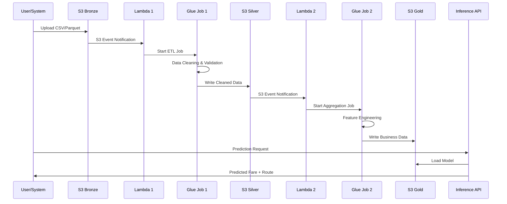
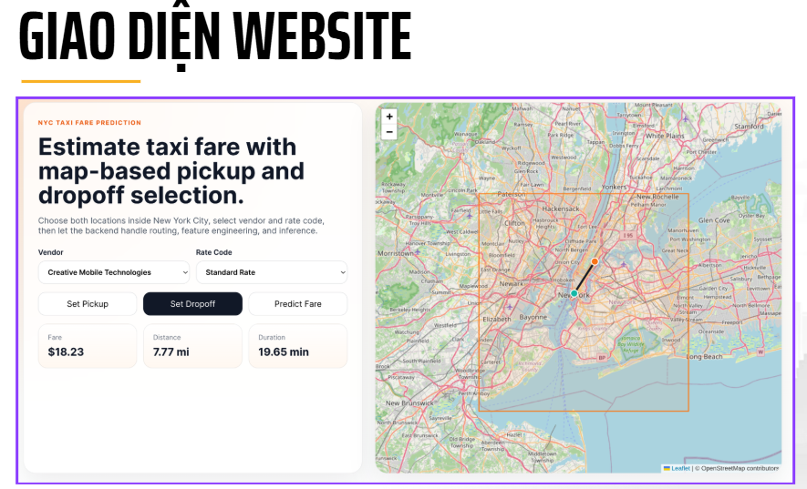
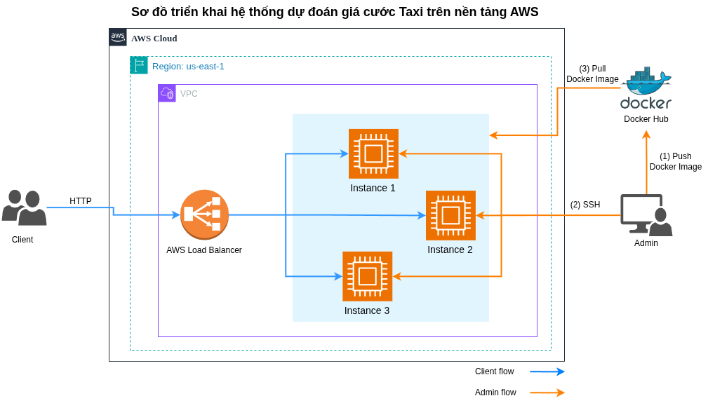

# 🚕 NYC Taxi Fare Prediction Pipeline

> **End-to-end serverless data pipeline on AWS for real-time taxi fare prediction using Medallion Architecture**

[](https://www.python.org/downloads/)
[](https://aws.amazon.com/)
[](https://spark.apache.org/)
[](https://fastapi.tiangolo.com/)
[](https://reactjs.org/)
[](https://docker.com/)
[](LICENSE)

## 🎯 Problem Statement & Key Features

**Challenge**: Build a scalable, cost-effective pipeline to process millions of NYC taxi trip records and provide real-time fare predictions with sub-second latency.

### ✨ Core Features

- **🏗️ Medallion Architecture**: Bronze → Silver → Gold data layers with automated quality gates
- **⚡ Event-Driven Processing**: Serverless ETL triggered by S3 uploads via Lambda functions  
- **🤖 ML-Ready Pipeline**: Automated feature engineering and model training workflows
- **🌐 Real-Time Inference**: FastAPI service with React frontend for interactive predictions
- **📊 Production Analytics**: Athena integration for business intelligence and monitoring
- **🔄 Auto-Scaling**: Serverless architecture handles varying data volumes efficiently
- **💰 Cost-Optimized**: Pay-per-use model with optimized resource allocation

## 🏗️ System Architecture

### Data Flow Diagram


### Processing Workflow



## 🛠️ Technology Stack

| Layer | Technology | Purpose |
|-------|------------|---------|
| **Storage** | AWS S3 | Multi-tier data lake (Bronze/Silver/Gold) |
| **Compute** | AWS Glue, PySpark | Distributed ETL processing |
| **Orchestration** | AWS Lambda | Event-driven pipeline triggers |
| **API** | FastAPI, Uvicorn | High-performance inference service |
| **Frontend** | React 18, TypeScript, Leaflet | Interactive map-based prediction UI |
| **ML Framework** | Scikit-learn, Pandas, NumPy | Model training & feature engineering |
| **Routing** | OSRM API | Real-time route calculation |
| **Analytics** | AWS Athena | SQL queries on processed data |
| **Deployment** | Docker, Multi-stage builds | Containerized production deployment |
| **Infrastructure** | IAM, CloudWatch | Security, monitoring, logging |

## 📁 Project Structure

```
cloud-taxi-price-pipeline/
├── 📂 assets/                          # Architecture diagrams
│   ├── Pipeline-NYC-Yellow-Taxi.drawio.png
│   ├── ImplementationFlow.drawio.png
│   └── schema diagram.drawio.png
├── 📂 src/                             # Core pipeline code
│   ├── 📂 glue/                        # ETL job scripts
│   │   ├── etl_bronze_to_silver.py     # Data cleaning & validation
│   │   └── etl_silver_to_gold.py       # Feature engineering & aggregation
│   └── 📂 lambda/                      # Event handlers
│       ├── bronze_to_silver_trigger.py # S3 → Glue Job 1 trigger
│       └── silver_to_gold_trigger.py   # S3 → Glue Job 2 trigger
├── 📂 inference/                       # ML inference service
│   ├── 📂 backend/                     # FastAPI application
│   │   ├── 📂 api/                     # REST endpoints
│   │   ├── 📂 services/                # Business logic
│   │   │   ├── prediction_service.py   # ML model inference
│   │   │   ├── feature_engineering_service.py # Real-time feature creation
│   │   │   └── routing_service.py      # OSRM route integration
│   │   ├── 📂 schemas/                 # Pydantic models
│   │   └── config.py                   # Environment configuration
│   ├── 📂 frontend/                    # React TypeScript app
│   │   └── src/App.tsx                 # Interactive map interface
│   ├── Dockerfile                      # Multi-stage production build
│   └── requirements.txt                # Python dependencies
└── 📂 notebooks/                       # Analysis & ML training
    ├── bronze-to-silver.ipynb          # Data cleaning exploration
    ├── silver-to-gold.ipynb            # Feature engineering analysis
    └── machine-learning.ipynb          # Model training & evaluation
```

## 🌐 Interactive Web Application

The project includes a full-stack web application that provides an intuitive interface for taxi fare predictions with real-time routing visualization.

### Frontend Features
- **Interactive Map Interface**: Click-to-select pickup and dropoff locations on NYC map
- **Real-time Route Visualization**: OSRM-powered routing with path display
- **Instant Fare Predictions**: ML model inference with sub-second response times
- **Responsive Design**: Modern React TypeScript interface optimized for all devices
- **NYC Boundary Validation**: Automatic validation of coordinates within NYC limits

### Backend API
- **RESTful FastAPI Service**: High-performance async API with automatic documentation
- **ML Pipeline Integration**: Seamless connection to trained prediction models
- **Feature Engineering**: Real-time calculation of distance metrics and temporal features
- **External API Integration**: OSRM routing service for accurate travel distance calculation

### Screenshots & Demo

**Main Interface**

*Interactive map showing NYC taxi fare prediction interface with pickup/dropoff selection*

**Deploy Architecture**  


### Deployment Options
**Production Deployment**
```bash
# Docker containerized deployment with multi-stage build
# Includes both frontend and backend in single container
docker build -t nyc-taxi-inference . && docker run -p 8000:8000 nyc-taxi-inference
```

## 📊 Key Results & Performance

### Pipeline Metrics
- **Processing Speed**: ~1M records/hour per Glue DPU
- **Data Quality**: 99.2% clean records after validation
- **Cost Efficiency**: 75% reduction vs. traditional ETL infrastructure
- **Latency**: <500ms average inference response time

### ML Model Performance  
- **Algorithm**: Gradient Boosting Regressor
- **RMSE**: $3.45 on test dataset
- **R² Score**: 0.847
- **Features**: 10 engineered features including distance metrics, temporal patterns

### Sample Prediction Output
```json
{
  "predicted_fare": 12.85,
  "trip_distance_miles": 2.34,
  "route_geometry": [[40.7589, -73.9851], [40.7505, -73.9934]]
}
```

## 🚦 Monitoring & Operations

- **CloudWatch Logs**: Real-time pipeline execution monitoring
- **Custom Metrics**: Data quality, processing latency, error rates
- **Alerting**: SNS notifications for job failures and anomalies
- **Data Lineage**: Full audit trail from bronze to gold layers

## 📈 Future Enhancements

- [ ] Real-time streaming with Kinesis Data Streams
- [ ] Advanced ML models (XGBoost, Deep Learning)
- [ ] Multi-region deployment for global availability
- [ ] GraphQL API integration
- [ ] Kubernetes orchestration support

---

## 👤 Author

**An Le**
[](https://github.com/Le-AnV)
[](https://www.linkedin.com/in/van-an-le-87b267371/)
